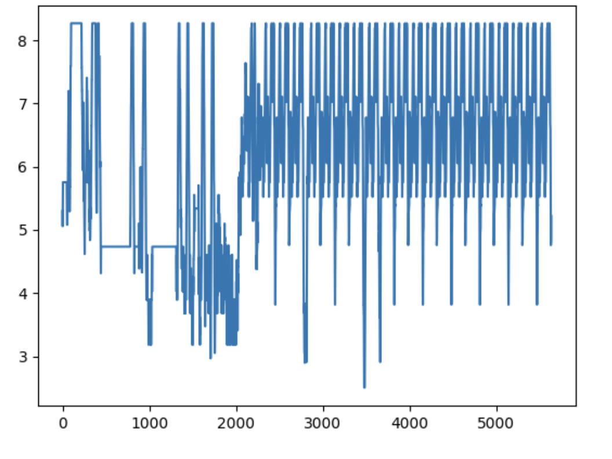
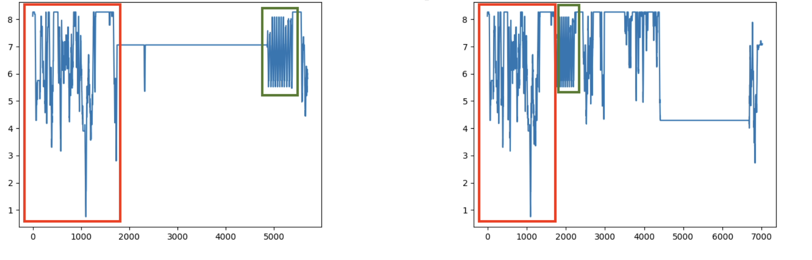

## Overview

During my professional experience at Eclexys-Octilium, I had the opportunity to work on AI cutting-edge projects that blended both cybersecurity and healthcare. This period included meaningful work in those fields, with several notable projects that helped me grow both technically and professionally.

---

## Cybersecurity

### Project 1: Malware detection

In this project, the idea consisted in analyzing collected executables suspected of representing malware samples. The main objective was to leverage their API representation in order to identify main malwares' fingerprints, enabling their systematic detection by AI automated techniques, no matter the obfuscation techniques employed.

#### The starting point
We proceeded by grouping APIs into categories describing their type of actions, e.g. read (r), write (w), or file (f) operations. Likewise, the initial API representation was spanned in a lower dimensional dictionary of actions, in such a way any executable original representation was translated into a finite sequence characters (e.g. fffwwrwrr ... ). 

Note: The dictionary of values grouping APIs is actually much larger than the example cited above, but cannot be disclosed. 

#### Entropy representation
Provided this new representation in terms of finite dictionary values, we could now infer probability distributions and leverage Shannon entropy representation for each executable. This not only provided a conversion in numerical values of original samples, but also provided a powerful graphical insight, allowing for immediate naked eye detection of similar patterns between different samples. 

#### Explored solutions
Being able to detect similar malwares by simply comparing their entropy representation is an interesting feature but much more may be achieved with ML techniques. By considering the entropy representation as numerical time-series, several methods can be employed here for classification. However, leveraging time-series clustering in this situation might be quite tedious due to their different lengths, and the employed obfuscation techniques.

#### Optimal retained solution
 After several employed methods around entropy representation, a step back was taken by reconsidering the character representation of each sample. We decided to employ instead NLP techniques, assuming that each malware throughout its fingerprint, might associate a specific language or a discussion topic. Likewise, the problem cann be undertaken as text classification. Applying therefore regular NLP methods shall be much more robust, not only considering the different "documents" lengths, but also in regards with the noise introduced by obfuscation. 

 The solution pipeline goes as follows: 
 - **Text embedding**: we embed numerically each document (the character representation for original samples) throughout employing TF-IDF or context-based methods such as Doc2Vec
 - **Latent space representation**: For retaining the maximum of information, the dimension set for Doc2Vec is quite high and can constitute a challenge for clustering. By employing auto-encoders on the Doc2Vec embedding, we rsignificantly reduce the vectors dimensions' and retain their latent representation, a much more powerful condensed set of information can be extracted
 - **Manifold learning method**: We combine the auto-encoder by "a manifold learning technique which ex-
plicitly takes local structure into account, that increases the quality of the representation learned in terms
of clusterability" (cite the article, talk about deep clustering). We used t-SNE and UMAP that behaved slightly better and was more stable. For the dimension, we typically choose half the dimension of the latent representation. 
- **Clustering**: Since we are supposed to evolve in the wild with no information on categories (number of malwares we will recover in a given database), we proceed to clustering. Density-based methods were preferred in absence of any assumption on reduced data distribution and homogeneity (therefore no K-means nor Gaussian Mixture Models).

#### The benchmark
Although the algorithm was designed to be employed in the wild, we still needed some benchmark for evaluating the methodology. We designed a database of 1000 well identified malwares, distibuted homogeneously across five families. The result was 100% classification accuracy, and the method was judged stable with respect to the several hyperparameters (Doc2Vec several parameters, auto-encoder dimension, manifold learning method parameters). 

#### Deployment
We were able to detect several malwares primarily absent from our database. Once important collection of each was recovered, we built malware classifiers, in a classical multi-class logistic approach.

#### Summary

- **Goal**: Detect and identify malwares from raw API representation 
- **Technologies used**: Dimensionality reduction methods (t-SNE, UMAP), NLP (TF-IDF, Doc2Vec), auto-encoders, clustering (DBSCAN, HDBSCAN)
- **Benchmark**: 1000 samples belonging to five malware families 
- **Results**: 100% classification accuracy on the benchmark, several new malwares detected on deployment 
- **Deployment**: Successful deployment, continuous running and follow-up on novel detections

### Project 2: Command prompt analysis - Anomaly detection & deviation from baseline (masquerade detection)

In the realm of cybersecurity and IT management, monitoring command prompt activities is crucial for
detecting unauthorized actions and ensuring system integrity. Command prompts, while powerful tools
for legitimate users, can also serve as entry points for malicious activities if misused. Automated analysis
of command prompt activities not only helps in proactive monitoring but also significantly enhances the
ability to quickly respond to potential threats. 

In this project, we therefore addressed command prompts and the possibility of raising automated alerts on the basis on detected malicious or unusual activities. We developed essentially two approaches:
- **Supervised**: Detecting specific Atomic Red Teaming (ART) attacks  
- **Unsupervised**: Detecting irregular activities within a specific network

We furthermore developed active learning techniques that took advantage from domain expertise in order to reduce False Positives during deployment.

#### Command prompts tokenization and NLP embeddings 
Although structured and following a specific logic, command prompts, unlike natural language, does not provide a straightforward decoupling into tokens. A specific work needed to be done with this regards that takes into consideration existence of paths, network-specific directories' names, parameters' variablity (e.g. a different ProcessId's, times, etc, ...), and several other aspects that might interfere with comparing specific actions or intent of a set of commands. 

We here addressed the problem by leveraging and comparing the performance of several tokenizations that decouples paths in different ways, lowered the influence of directories' name, and created placeholders for a certain type of parameters, such as numbers, hashes, IP addresses, and so on. Once the tokens are produced within a specific corpus, we use regular NLP techniques for numerically embedding each command. We compared FastText and TF-IDF, both in the word and character based fashion. 

#### Supervised approach for ART detection
Since we needed labeled data for this approach, we used ART attacks from an open-source project developed by Red Canary (c.f. [https://github.com/redcanaryco/atomic-red-team](https://github.com/redcanaryco/atomic-red-team)). The initiative provides a library of security tests, which are mapped to the MITRE ATT&CK® framework.

We constructed a labeled dataset around this data (as positive class instances), coupled with locally generated data from regular network activity, simulated on our labs (as negative class instances). As model, we opted for XGBoost and hypertuned parameters to reach training and test accuracies of respectively 98,45% and 97,5%. We conducted a benchmark experiment where we run around 500 ART attacks, randomly executed within a network of computers. The rate of attacks compared to the amount of regular commands represented around 1%. The experiments results yielded a precision of approximately 93% and a recall of 87%.  

#### Unupervised approach for detecting deviation from baseline activities
Malicious activity within a network do not necessarily characterize throughout ART attacks. We therefore developed a second approach meant for detecting irregular activity that deviates from the standard behaviour of a specific user. The aim consisted in generating alerts for actions, that were either considered by domain experts as legit and simply novel (install new programs, softwares, new user), either evaluated as suspicious and worth further investigation. The algorithm acted therefore as a decision support system for domain experts to monitor and assess thousands of daily commands, while only leveraging a very little number of alerts. 

For this approach, we relied on auto-encoders. More specifically, we selected data from a specific network and made sure no malicious activity were detected. This data was then used for training an auto-encoder, for which a distribution of the reconstruction loss was constructed. A threshold corresponding to 98th-percentile of that distribution was then fixed, and command prompts with a higher reconstruction loss were judged irregular. 

Building performance metrics' on this approach is somehow not straightforward, since "irregular activity" is not necessarily malicious. We therefore asked our domain experts during deployment to assess the alerts for whether the latter were considered interesting and worth further exploration, or whether they were simply uninteresting. The experiments were conducted on three separate and distinct network and yielded precisions of 39%, 74% and 79%. The difference in results found explanation in the quantity of available data on each network, where precision systematically augmented with more available data. 

#### Active learning for the unsupervised approach
We enhance our alert system with an active learning mechanism, based the on methodology developed in (TBD:cite Deep active learning for
anomaly detection paper). Essentially, the method involves an additional supervised layer on top of the initial AD auto-encoder. More precisely, we extract both the latent representation and reconstruction error for the samples positively flagged (unusual). We concatenate those to form single vectors before feeding them to an additional supervised layer leveraging the labels provided by domain expertise. In the original paper (TBD:cite same paper), a single-layer neural network is considered but in theory any supervised algorithm could be employed. We here took advantage of a double-layer neural network after a Bayesian hyperparameter search.

On deployment, the active learning enhancement showed to raise the precision around 90%, while maintaining the recall to a reasonable 80%, for a total accuracy of 94%.

#### Deployment state 
Both approaches are deployed on three client sites, with the unsupervised enhanced by the additional active learning feedback. They raise alerts on a daily basis with a very reduced amount of False Positives. Eventually, we program new auto-encoder training every third month to integrate new regular activity. 

---

## Healthcare

### Project 1: CAREPATH

[CAREPATH](https://www.carepath.care/) is a Horizon 2020’s funded project that proposes an ICT based solution for the optimization of clinical practice in the treatment and management of multimorbid elderly patients with Mild Cognitive Impairment or Mild Dementia. The project is composed by a consortium of 10 partners from multi-disciplinary environments involving clinicians, academicians and technicians of very different background. 

My specific role in this project was to develop all the ML machinery related to the Advanced Early Warning Smart Decision Tools (AEWSDT), a block of state-of-the-art AI-based diagnostic tools leveraging all the monitored data of the project for several well-being purposes.

#### Collected data 
During the pilot phase, 102 patients uniformly distributed across 4 countries are constantly monitored with respect to their vital biomarkers. These are provided throughout connected medical devices. They are also equipped with connected smartwatches, that constantly report on their sleeping and movement data. The houses they live in are additionally supplied with domotic sensors of all kind (temperature, air quality, door/motion sensors). Questionnaire data are also meant to be collected a several milstones of the project. 

#### AEWSDT and the developped solutions 
The following components were developed: 

- **Monitoring of Intrinsic Capacity (IC) and trajectory prediction**: [IC](https://www.vitality-medicine-and-engineering-journal.com/2551-w-h-o-world-health-organization-program-on-maintaining-intrinsic-capacities-with-aging.html) is a World Health Organization developed and validated concept. It refers to the individual's inherent ability to function across various domains of life, such as physical, mental, and social functions. It has also been proved that its decline correlates directly with a decline in the Activities of Daily Living (ADL). 

We developed mathematical models involving the monitored data to continuously track on IC, and used ML forecasting methods for its prediction in time, offering a visibility on a potential decline in an elderly's capailities.

 - **Dementia profile estimation**: The project is centered around people at risk of developing dementia. Dementia diagnosis is a heavy procedure that involves clinical evaluation and tests that represent a heavy burden for the  healthcare system. They aim at classifying a person among one of these categories: (1) normal cognition, (2) Mild cognitive impairment, (3) Mild dementia, (4) Moderate dementia, and (5) Severe dementia. 

 We therefore leveraged the collected data for automatically evaluate the dementia profile of specific person, and provide clinicians with a very precise and accurate classification tool. We furthermore developed a probabilistic approach for evaluating the chances of progressing towards different classes of cognitive impairment, enabling early warning alerts when a cognitive decline was perceived. 

- **Risk statification**: We evaluate the [frailty](https://www.cfn-nce.ca/frailty-matters/what-is-frailty/) score of participants using collected questionnaire data. 

#### Additional developments    

On top of the AEWSDT tasks described above, we also worked on the follwoing solutions:

 - **Anomaly detection for home monitored data**: We followed on the domotics sensors and provided early warning to clinicians on the basis of detect anomalies in the home monitored data.

 - **Wandering detection**: With the motion sensors, we developed wandering detection based on specific patterns.

As part of the AI healthcare team, I contributed to the development of an AI-based diagnostic tool that aids doctors in diagnosing rare diseases by analyzing medical imaging data.

#### Summary 

- **Role**: Responsible and developer of AI-based solutions
- **Technologies used**: mathematical modeling, time-series forecasting and anomaly detection, multi-class logistic regression 

### Project 2: CAREUP

[CAREUP](https://www.aal-europe.eu/projects/careup/) is an [AAL](https://www.aal-europe.eu/) funded project in which the main goal was to develop an integrated care platform based on the monitoring of older individual Intrinsic Capacity (IC) for inclusive health. The project is composed by a consortium of 9 partners, from multi-disciplinary environments just like CAREPATH (see above).

In CAREUP, I worked on creating a framework for evaluating and predicting IC. I collaborated extensively with [INRCA](https://www.inrca.it/inrca/) researchers and [WUT](https://iot.ire.pw.edu.pl/) academicians on delivering a questionnaire-based evaluation of IC, and providing forecasting methods based on longitudinal collected data from different sources. The project is on the piloting phase (year 2025), and the collaboration work yielded co-authorship in two papers:

TBD: put papers here 

---

## Conclusion

I deeply enjoyed my multi-disciplinary experience at Eclexys. I had the chance to work on developing novel and state-of-the-art tools for cybersecurity activities, which was for me a perfect compromise for brindging the gap between research and industry. When it comes to the healthcare experience, I grew an important experience collaborating with different profiles of people and enjoyed the responsibility of leading ML activities, aiming to the creation of AI tools delivered for the healthy ageing of elderly.  