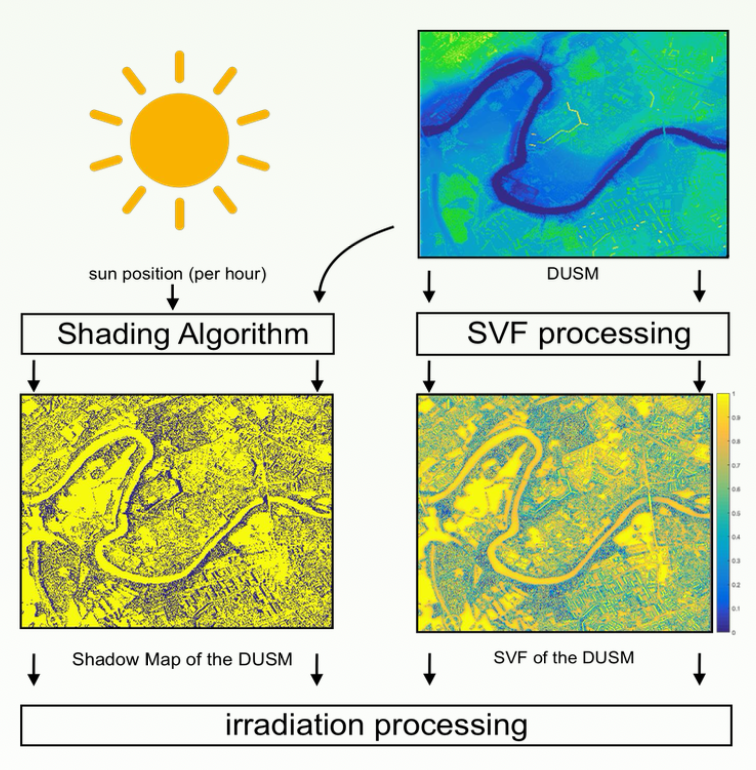

## Overview

The iCeBound project is a collaborative project between Hepia, CERN and the city of Geneva, that focuses on designing and developing a Decision Support System that leverages 3D digital urban data to facilitate environmental analyses in cities. The main desired usage of such a tool is to evaluate the potential of building roofs located in urban areas for producing solar energy and to identify good candidate roofs for installing solar panels, by calculating a yearly radiation map for the whole city of Geneva.

The model for computing the radiation map relies on a computationally costly algorithm, the Sky Viewing Factor, as this took initially around 150 minutes on 40 CPUs to be computed for a small portion of land. My primary task was to transfer an existing cloud based implementation to GPUs in order to investigate the potential of acceleration and a subsequent deployment of the GPU based software.

The outcome of the project was quite satisfying, as it led to a demonstrated 
acceleration of two orders of magnitude (10 times faster on a single GPU compared to 40 CPUs), hence enabling the modeling of the entire Geneva region. The implementation on multiple GPUs was further deployed on the Amazon Web Services cloud for public use purposes, with a treatment cost reduced by a factor of 100 in comparison with the initial code version.

<iframe src="../slides/master_thesis_hepia.pdf" width="100%" height="600px"></iframe>

[Download the PDF](path/to/your/file.pdf)

